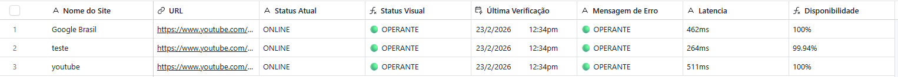
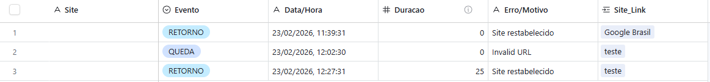

## 📸 Demonstração do Sistema

Abaixo, você pode conferir o funcionamento integrado entre o Bot, Airtable e as notificações em tempo real.

### 1. Painel de Controle (Airtable)
Visualização da tabela principal com status em tempo real, latência e o cálculo automático de disponibilidade (SLA).


### 2. Histórico de Incidentes
Registro detalhado de cada evento de queda e retorno, utilizando vínculos relacionais para associar logs aos sites específicos.


### 3. Notificações Mobile (Telegram)
Alertas instantâneos enviados via n8n informando o erro detectado e o tempo total de inatividade após o restabelecimento.


# 🚀 SaaS Uptime Monitor (Node.js + Airtable + n8n)

Um sistema de monitoramento de disponibilidade de sites robusto, inspirado em ferramentas como UptimeRobot. O projeto utiliza um robô em Node.js para checagem de status, Airtable como banco de dados relacional e motor de cálculo de SLA, e n8n para orquestração de alertas via Telegram.

## 🛠️ Tecnologias Utilizadas

* **Node.js**: Motor principal do bot de monitoramento.
* **Airtable**: Banco de dados relacional e cálculo automático de Uptime %.
* **n8n**: Automação de workflow e notificações via Webhook.
* **Telegram API**: Canal de alertas em tempo real.
* **Axios**: Para requisições HTTP e integração com APIs.

## ✨ Funcionalidades

- **Monitoramento 24/7**: Checagem de status HTTP e latência a cada minuto.
- **Banco de Dados Relacional**: Logs de incidentes vinculados automaticamente aos sites através de IDs únicos (Record IDs).
- **Cálculo de Uptime % (SLA)**: Fórmula automatizada que desconta o tempo de inatividade do total mensal (base 30 dias/43.200 min).
- **Notificações Inteligentes**: Alertas de queda (DOWN) e retorno (UP) com tempo total de inatividade.
- **Histórico de Incidentes**: Registro detalhado de motivos de erro para auditoria.

## 🏗️ Estrutura da Base Airtable

O sistema exige duas tabelas conectadas:

1.  **Sites Monitorados (Principal)**:
    - `Nome do Site` (Texto)
    - `URL` (URL)
    - `Status Atual` (Single Select: ONLINE/OFFLINE)
    - `Duracao` (Rollup: Soma o campo duração da tabela de logs)
    - `Uptime %` (Fórmula de cálculo de SLA)
2.  **Historico_Incidentes (Logs)**:
    - `Site_Link` (Link to another record: Conecta à tabela principal)
    - `Evento` (QUEDA/RETORNO)
    - `Duracao` (Number: Minutos fora do ar)
    - `Data/Hora` (Texto/Data)

## 🚀 Como Configurar

### 1. Clonar o repositório
```bash
git clone [https://github.com/SEU_USUARIO/nome-do-seu-repositorio.git](https://github.com/SEU_USUARIO/nome-do-seu-repositorio.git)
cd nome-do-seu-repositorio
2. Configurar o Bot (Node.js)
Entre na pasta bot/, instale as dependências e configure o seu .env:

Bash
cd bot
npm install
Crie um arquivo .env:

Snippet de código
AIRTABLE_PAT=seu_token_aqui
BASE_ID=id_da_sua_base
TABLE_ID=id_da_tabela_principal
N8N_WEBHOOK_URL=link_do_seu_webhook_n8n
3. Importar Workflow n8n
Abra seu n8n.

Crie um novo workflow.

No menu, selecione Import from File e escolha o arquivo workflow-n8n/uptime-monitor-flow.json.

Configure as suas credenciais do Telegram.

4. Rodar a aplicação
Bash
node uptime.js
📊 Cálculo de SLA (Fórmula Airtable)
Para calcular a disponibilidade, utilizamos a seguinte fórmula no Airtable:

Snippet de código
IF({Duracao} > 0, 
  ROUND((1 - ({Duracao} / 43200)) * 100, 2) & "%", 
  "100%"
)
